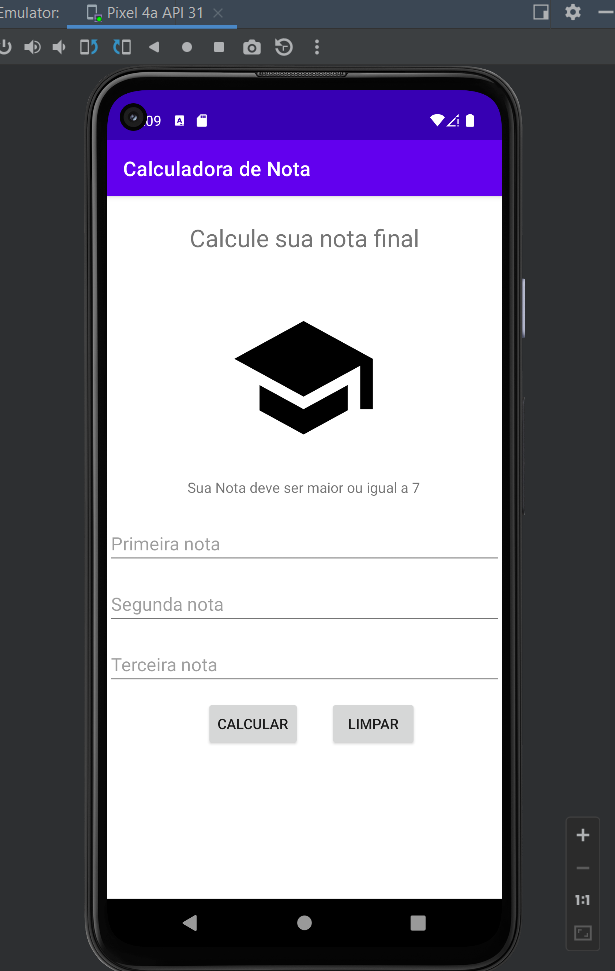
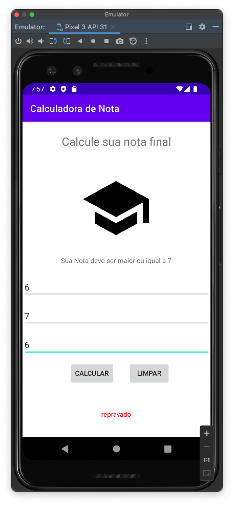

# mob-25-aplicacoes-android-aula3-calculadorad

# Calculadora de nota
VersionCode: 1.0

VersionName: "1"

# Introdução
Calculando se o aluno foi aprovado ou não

| Tela 1     | Tela 2     |  
| ------------- | ------------- |
|||

# Authors

Danilo Santos
[@danilopsnts](https://www.linkedin.com/in/danilopsnts/)