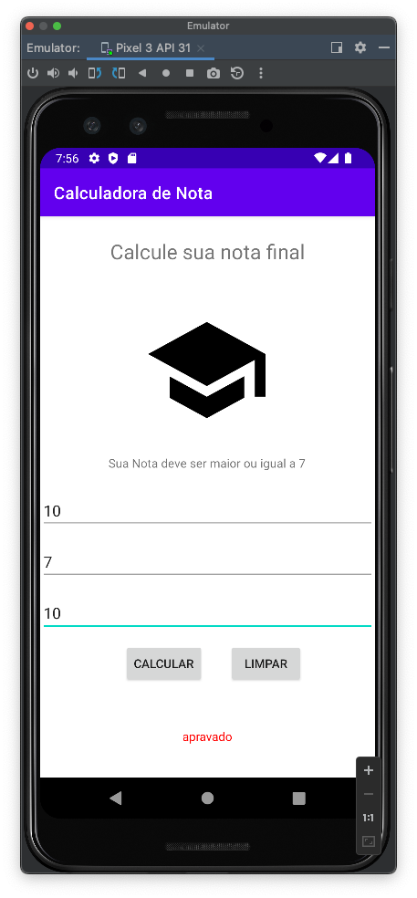

# mob-25-aplicacoes-android-aula3-calculadora

# Calculadora de nota
VersionCode: 1.0

VersionName: "1"

# Introdução
Calculando se o aluno foi aprovado ou não, para isso vamos solicitar que o aluno adicione 3 notas para assim aplicar o cálculo da média, onde o resultado deve ser maior que 7.

## Cálculo Média
Soma das 3 notas o resultado será dividido por 3.

| Tela 1.1     | Tela 1.2     |
| ------------- | ------------- |
|||
|||

# Authors

Danilo Santos
[@danilopsnts](https://www.linkedin.com/in/danilopsnts/)