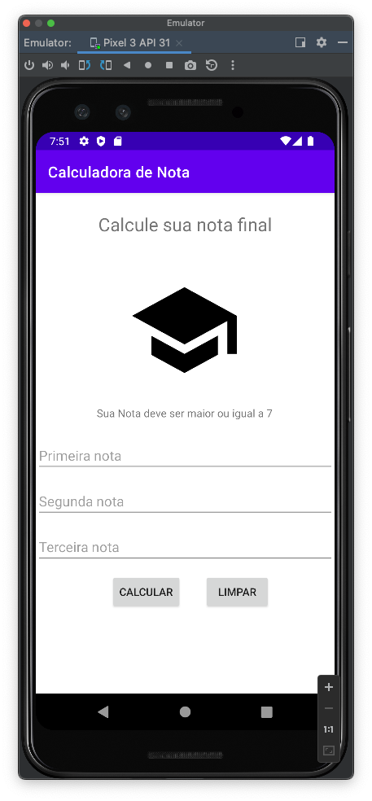

# mob-25-aplicacoes-android-aula3-gasolina

# Gasolina ou álcool?
VersionCode: 1.0

VersionName: "1"

# Introdução
Calculando se o aluno foi aprovado ou não

# Authors

Danilo Santos
[@danilopsnts](https://www.linkedin.com/in/danilopsnts/)